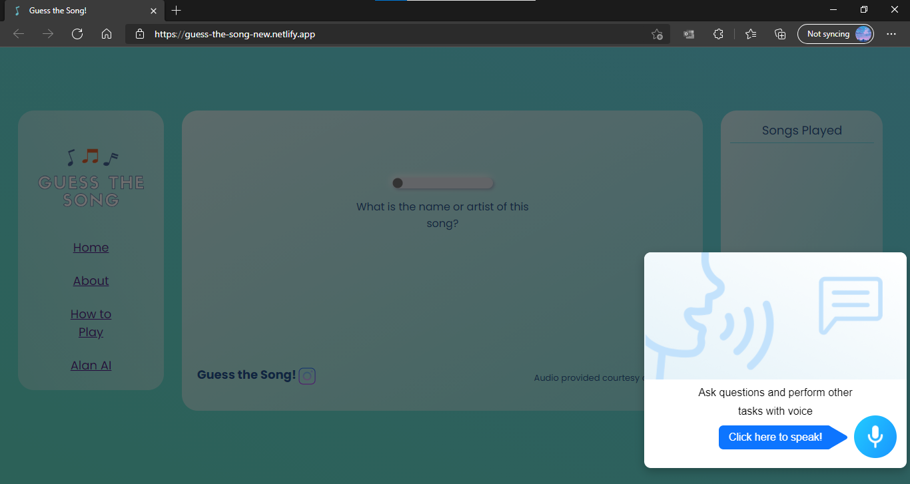

# guess-the-song
> Project Guess The Song is a simple single player guessing the song game. However, with the integration of Alan AI's voice assistant, the user experience is vastly greater than the conventional game.
> 
> Game Link: https://joeywsd.github.io/guess-the-song/

## Table of Contents
* [General Info](#general-information)
* [Technologies Used](#technologies-used)
* [Features](#features)
* [Screenshots](#screenshots)
* [Project Status](#project-status)
* [Room for Improvement](#room-for-improvement)
* [Acknowledgements](#acknowledgements)
* [Contact](#contact)

## General Information
- Under the Alan AI internship from Pilot City, I developed the game "Guess The Song", which highlights how Alan AI's voice assistant can elevate the user's experience. Instead of the user having to type in the name of the artist or the song, the user simply has to speak. This seemingly small, yet very impactful change can greatly improve the conventional game. I am undertaking this project because I thought this would be a fun, educational challenge.

## Technologies Used
- HTML 5
- CSS level 3 
- (Vanilla) Javascript ES6
- Alan AI - put the "AlanAI" file into the Alan AI platform & change the integration.

## Features
- Alan AI voice assistant as game host
- Extensive Library of Songs through iTunes Search API
- Displays Correct Answers
- Easter Egg

## Screenshots

## Project Status
In Progress

## Room for Improvement
To do:
- Multiplayer functionality
- Refactoring

## Acknowledgements
Give credit here.
- This project was inspired by https://www.youtube.com/watch?v=VjgL_TD9JpQ, https://www.youtube.com/watch?v=O7WbVj5apxU, https://songtrivia2.io/, and https://github.com/lpinca/binb

## Contact
Created by [@guess_the_song2021](https://www.instagram.com/guess_the_song2021/) - feel free to contact me!

